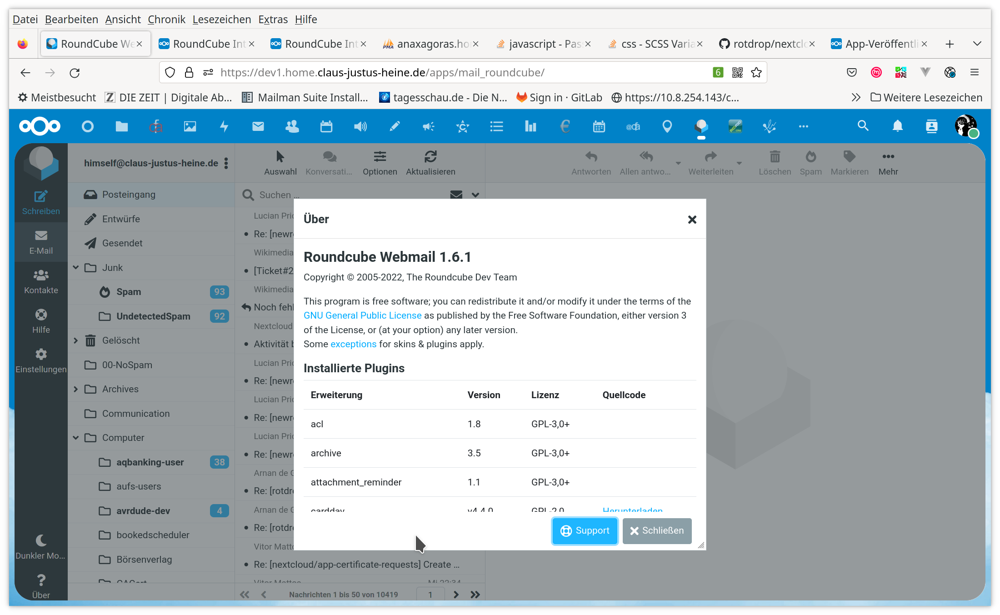
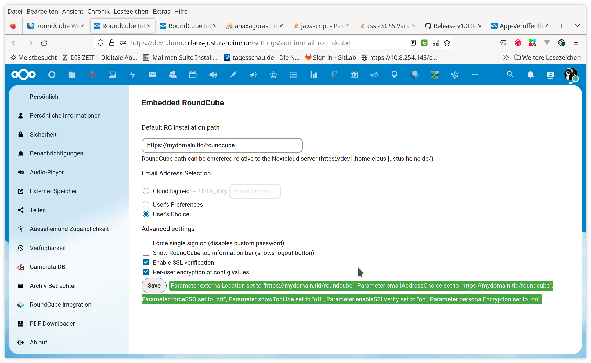
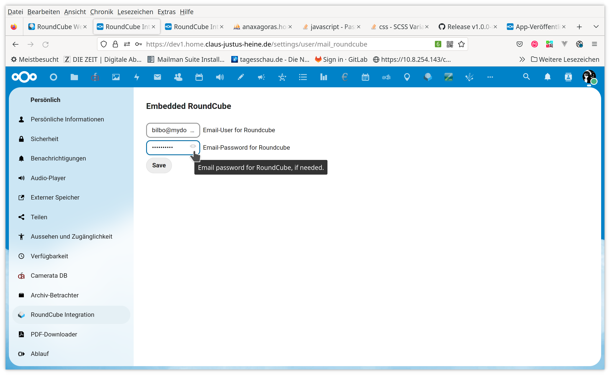

# RoundCube Web Mail

<!-- markdown-toc start - Don't edit this section. Run M-x markdown-toc-refresh-toc -->
**Table of Contents**

- [RoundCube Web Mail](#roundcube-web-mail)
    - [Intro](#intro)
    - [Installation](#installation)
    - [More docs to follow ...](#more-docs-to-follow-)
    - [Screenshots](#screenshots)
        - [Main Window](#main-window)
        - [Preferences](#preferences)
            - [Admin Settings](#admin-settings)
            - [Personal Settings](#personal-settings)

<!-- markdown-toc end -->


## Intro

This is a [Nextcloud app](https://nextcloud.com/) app which embeds an
separate [Roundcube](https://roundcube.net/) web-mailer installation
by means of an IFrame into you Nextcloud server installation.

The app can be configured to do some sort of single sign on (SSO) if
the email-server and Nextcloud share a common user and authentication
framework. Otherwise the users can configure their email credentials
in the app's personal settings.

This was originally a fork from

https://github.com/LeonardoRM/owncloud-roundcube

which in turn is based on a very early Owncloud app (discontinued)

https://github.com/hypery2k/owncloud

However, now this fork just concentrates to embed an external
Roundcube installation into a Nextcloud installation, there is no intent to keep
compatibility with Owncloud.

Knowning that there is nowaday a dedicated native Nextcloud email app this might be
questionable. OTOH, Roundcube is a very mature email web app with many nice plugins. 

Currently the focus is on Roundcube version v1.6 and Nextcloud version
25 and on pushing this fork into the Nextcloud app-store.

## Installation

### Nextcloud App

Hopefully an installation is possible by one of the following alternatives:

- ~install from the Nextcloud app-store~ (not yet)
- download a (pre-)release tarball and extract it into you app directory
- the assets are also contained in the git repo, so simply cloning the git-repo into your app folder *maybe* just works. Maybe not ...
- clone into your app-folder and compile from source, do a `make dev` or `make build`. You need `composer` and `node` (`npm`). `make help` or just `make` will list the available targets.

### Roundcube App

Please refere to the [Roundcube](https://roundcube.net/) documentation for general installation instructions.

## Configuration

### Adminstration, Web-Server Setup

#### TL;DR

Due to the technology used -- Roundcube just runs in an
[iframe](https://developer.mozilla.org/en-US/docs/Web/HTML/Element/iframe)
there are some restrictions caused by the [same origin
policy](https://developer.mozilla.org/en-US/docs/Web/Security/Same-origin_policy)
which at least nowadays are widely in use.

In principle this boils down to the point that the Nextcloud server
installation and the Roundcube installation must be served in the same
DNS domain.

#### NC Domain equal RC Domain

In this case nothing special has to be done. The administrator can
simply enter the location of the Roundcube installation in the
adminstrator settings of the app.

#### Different Domains, but same Web-Server

In this case the simplest thing is to just map the Roundcube
installation a second time by a simple alias directive.

##### Apache

Example for [Apache](https://httpd.apache.org/docs/2.4/mod/mod_alias.html):

```
Alias /SOME_WEB_PATH PATH_TO_EXISTING_ROUNDCUBE_INSTALLATION

```

This directive should be placed in the virtual host definition of
the Nextcloud server installation.

In the administration settings for the NC app you can then enter
whatever you have chosen for `/SOME_WEB_PATH`.

##### Example for NGINX

**Please doc me!**

#### Different Domains, different Web-Server

In this case it is possible to map the existing external Roundcube
installation into the Nextcloud server domain by means some proxy
directives.

##### Necessary Roundcube Setup

Cause by changes in the transition from Roundcube verison 1.5 to
Roundcube version 1.6 we have now the problem that all web-paths used
by Roundcube are absolute. And this severely breaks any reverse proxy
setup unless you have access to the Roundcube installation. The point
is the new configuration directive

```
$config['request_path'] = REPLACE_ME_WITH_SOMETHING_WORKING;
```

Please have a look at the explanations in
[defaults.inc.php](https://github.com/roundcube/roundcubemail/blob/e2370544907034679d47a8be348a5b2a796fcdf9/config/defaults.inc.php#L821-L829).

A working setting -- but I suppose it undermines the security
improvements which were the cause for the new setting -- is the
following which in essence reestablished the previous behaviour to
have only relative links:

```
$config['request_path'] = '.';
```

**BIG FAT NOTE**: if you use Roundcube 1.6 and do nothing then
proxying will just not work (but please feel free to convince me from
the opposite by providing a configuration example ;)).

##### Example for Apache

Place something like the following into the virtual host setup for
your Nextcloud server:

```
ProxyRequests Off
gSSLProxyEngine on
<Location /SOME_WEB_PATH/>
    # Try to do the same with a proxy configuration
    ProxyPass https://webmail.my-domain.tld/
    ProxyPassReverse https://webmail.my-domain.tld/
    ProxyPreserveHost Off
</Location>
```

Please note that you probably have `ProxyPreserveHost On` in the
configuration for the push notifications service. If you try this then
please first check the proxy settings independent from the us of it in
this app, i.e. just open the proxied-location in you web-browser,
log-in manually and check if it works.

##### Example for NGINX

**Please doc me!**

### Personal Settings

**Please doc me!**

## More docs to follow ...

## Screenshots

### Main Window



### Preferences

#### Admin Settings



#### Personal Settings


